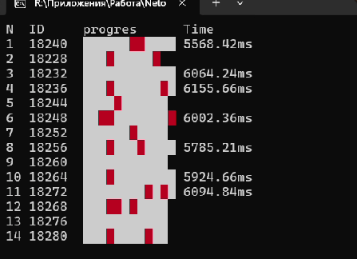

#### Прогресс-бар для имитации многопоточного расчёта.
В консоль во время работы программы должны построчно для каждого потока выводиться:
- номер потока по порядку;
- идентификатор потока;
- заполняющийся индикатор наподобие прогресс-бара, визуализирующий процесс «расчёта»;
- после завершения работы каждого потока в соответствующей строке суммарное время, затраченное на работу потока.  

Прогресс-бар представляет собой закрашенные определённым цветом квадраты в консоли. Строки прогресс-баров каждого потока выводятся одновремено.  
Дополнительно есть имитация со случайной вероятностью возникновения ошибки (exception), которая не приводит к прекращению работы потока или программы. При этом этот факт визуализируется отдельным цветом на прогресс-баре.  
Для реализации использовался std::condition_variable. В каждом потоке время каждого этапа имитируемого расчёта определяется случайным образом. Функция bar имитирует расчёт, printBars выводит результат на консоль, класс massag используется для обмена данными между потоками.  
Пример:  
